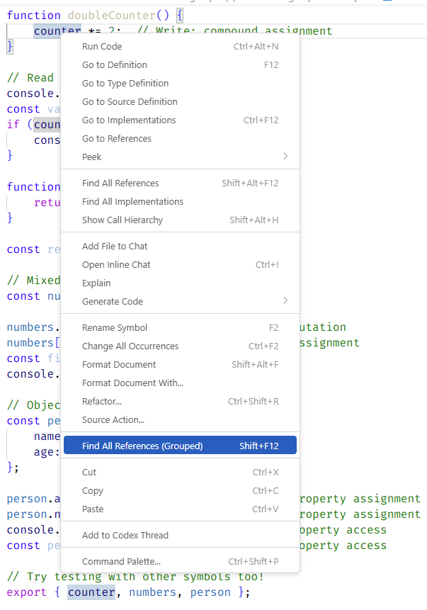
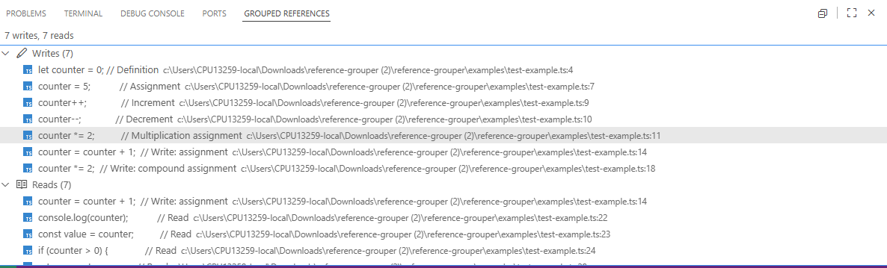
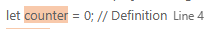
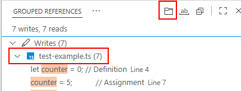
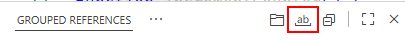

# Reference Grouper

A Visual Studio Code extension that groups references into **Read** and **Write** categories in the references view.

## Screenshots



*References grouped by Writes and Reads in the bottom panel*

## Features

- 📖 **Read References**: Shows all places where a symbol is read/accessed
- ✏️  **Write References**: Shows all places where a symbol is modified/written to
- 🔢 **Reference Counts**: Displays the count of reads and writes
- ⚙️ **Configurable**: Enable/disable grouping and counts through settings

## Usage

1. Place your cursor on a variable, function, or symbol
2. Use one of these methods:
   - Right-click and select "Find All References"
   - Press `Shift+F12` (default keybinding)
   - Press `Shift+Alt+F12` (extension keybinding)
   - Use Command Palette: `References: Find All References (Grouped)`
3. The extension will show references grouped into:
   - **Writes**: Assignments, increments, decrements, mutations
   - **Reads**: All other references

### Example



The bottom panel shows:
- ✏️ **Writes (7)** - All places where the variable is modified
- 📖 **Reads (7)** - All places where the variable is accessed

Click on any reference to jump to that location in your code.

## Write Detection

The extension identifies writes by detecting:

- Assignment operators (`=`, `+=`, `-=`, `*=`, etc.)
- Increment/decrement operators (`++`, `--`)
- Destructuring assignments
- Function parameters
- Array/object mutations (`push`, `pop`, `splice`, etc.)

## Configuration

Access settings through `File > Preferences > Settings` or search for "Reference Grouper":

```json
{
  // Enable or disable reference grouping
  "referenceGrouper.enabled": true,
  
  // Show count of references in each group
  "referenceGrouper.showCounts": true
}
```

## Installation

### From Source

1. Clone or download this repository
2. Open the folder in VS Code
3. Run `npm install` to install dependencies
4. Press `F5` to launch the extension in debug mode
5. Test in the Extension Development Host window

### Building VSIX

1. Install vsce: `npm install -g @vscode/vsce`
2. Package the extension: `vsce package`
3. Install the `.vsix` file: `code --install-extension reference-grouper-0.5.0.vsix`

## Development

### Setup

```bash
npm install
npm run compile
```

### Watch Mode

```bash
npm run watch
```

### Testing

Press `F5` in VS Code to launch the Extension Development Host for testing.

You can use the example file in `examples/test-example.ts` to test the extension.

## Requirements

- Visual Studio Code 1.85.0 or higher
- TypeScript support for best results

## Known Limitations

- Write detection is heuristic-based and may not catch all write patterns in all languages
- Works best with JavaScript, TypeScript, and similar C-style languages
- Some complex write patterns (like certain destructuring) may be classified as reads

## Roadmap

- [ ] Language-specific write detection (Python, Java, C++, etc.)
- [ ] Tree-sitter integration for more accurate analysis
- [ ] Customizable peek view
- [ ] Filter references by type
- [ ] Export reference reports

## Contributing

Contributions are welcome! Please feel free to submit issues or pull requests.

## License

MIT

## Release Notes

### 0.1.0

Initial release with basic read/write grouping functionality.

### 0.5.0

Added highlight feature



Added group by file feature



Added toggle file fullpath feature


